# Taller de Redes Neuronales.

Automatic Differentiation: Dinamic Pruning in Forward Mode (DPFM)

https://github.com/daradija/dinamic-pruning-in-forward-mode-2


<a href="https://www.youtube.com/watch?v=tn9BljZhj0Y" target="_blank">
    
</a>

https://youtu.be/tn9BljZhj0Y

# Motivación
En la búsqueda de nuevas formas de colaborar, he realizado esta iniciativa. Ajustar la agenda de los distintos investigadores en el día a día es complejo. Así que quiero hacer uso de herramientas que permitan a cada cual llevar su ritmo. Las herramientas son:

- Github para compartir el código, recepcionar mejoras y realizar documentación.
- Videos como material que facilite la accesibilidad.
- Dejar problemas abiertos. 
 
Uno de los problemas que he encontrado en las conferencias que he asistido es que dan soluciones. Dar una solución no ayuda a colaborar. En este sentido he querido dejar un problema técnico abierto e incluir al final un apartado a modo de ensayo.

Mi objetivo es cualquiera con cierta pericia técnica, paciencia puede realizar una aportación al repositorio.

# Objetivo
¿Es posible desarrollar redes neuronales mas eficientes mediante el paralelismo que proporciona Dinamic Pruning in Forward Mode?
¿Es posible crear un hardware específico para entrenar?

# Índice

1. Explicación de una Red Neuronal en Modo Forward  
    1.1 Sobrecarga de operadores en Python  
    1.2 Topología básica de una red neuronal  
        1.2.1 Producto escalar  
        1.2.2 Activación sigmoide  
    1.3 Batchs, gradientes y minimización del error cuadrático medio  

2. Pruning  
    2.1 Latencia de TensorFlow  
    2.2 Entender el potencial paralelizable y la infrautilización de recursos  
    2.3 En funciones sencillas el pruning es beneficioso  

3. Desarrollo sin errores  
    3.1 Simbólico  
    3.2 Python → Numpy  
    3.3 Numpy → Numba  

4. Hardware (busco colaboradores)  
    4.1 Potencial de una FPGA  
    4.2 TensorRT y latencia  
    4.3 Alternativa más eficiente que NVIDIA  
    4.4 Potencial de artículos: Revisión de todas las arquitecturas de redes neuronales  
    4.5 Construcción de una librería  

5. Explicación detallada del Forward Mode  
    5.1 Derivadas y memoria requerida  
    5.2 Función de activación y su impacto en la estructura de datos  
    5.3 ¿Cómo se utilizan los gradientes?  
    5.4 Minimización del error cuadrático medio  
        5.4.1 Propuesta de pruning dinámico  
        5.4.2 Gradientes significativos  

6. Limitaciones de TensorFlow/NVIDIA  
    6.1 Paralelización y multiplicaciones simultáneas  
    6.2 Latencia de los kernels  
    6.3 Procesos en tiempo real y TensorRT  
    6.4 Sobrecarga de operadores en Python  

7. Explicación del Código en Python (autofore.py)  
    7.1 Diferenciación simbólica  
    7.2 Segunda derivada Hessiana  
    7.3 Ejemplo de red neuronal polinómica  
        7.3.1 Sistema de ecuaciones  
        7.3.2 Verificación de la convergencia  
        7.3.3 Cálculo del error  
    7.4 Ejemplo de pruning en el código  

8. Ejecución de simpleTensorFlow.py  
    8.1 Definición del modelo secuencial  
    8.2 Añadir capas densas y activación sigmoide  
    8.3 Cálculo del error cuadrático medio con SGD  

9. Potencial de una FPGA  
    9.1 Comparación de rendimiento frente a TensorFlow  
    9.2 Inferencia acelerada con numpy  

10. Potencial de publicaciones  
    10.1 Alternativa a NVIDIA  
    10.2 Revisión de arquitecturas de redes neuronales  
    10.3 Aprendizaje distribuido y en tiempo real  
    10.4 Construcción de librerías y hardware  

11. Pruebas de rendimiento  
    11.1 Comparación con distintos tamaños de corpus  
    11.2 Interpretación de los resultados  

12. Circuito de Toper  
    12.1 Ordenación en hardware  

13. Conclusiones  

14. Itinerario  
    14.1 Aceleración de la librería en Python  
    14.2 Pruebas con NMIST  
    14.3 Publicaciones y tesis doctoral  
    14.4 Prototipos con FPGAs  
    14.5 Aplicaciones a robótica y protocolos de conducción autónoma  

# Explicación de una Red Neuronal en modo Forward.
Ahora esta de moda hardware especifico de inferencia. Y el entrenamiento se concibe como un proceso separado.
Los modelos de lenguaje profundo son cuestionados por su alto consumo energético. La misma Microsoft está activando una central nuclear para asegurarse el suministro electrico para un centro de cálculo. 
Por otro lado NVIDIA lidera el proceso de aprendizaje en GPU. Estamos absorto por los avances que no cuestionamos el tamden tecnológico, por ejemplo: NVIDIA / Tensorflow. 

¿Merece la pena investigar otras alternativas?
 
Dentro del entrenamiento la backpropagation es una de las piezas angulares. Dicho algoritmo requiere dos pasadas, una computando los cálculos y una segunda pasada en sentido inverso al gráfo de operaciones hallando los gradientes.
La primera pasada es una inferencia o hallar un resultado. En la segunda se parte del error medio o agrupado de un lote y se realiza una ligera corrección de los pesos. 
Aunque matemáticamente el modo de backpropagation es mas eficiente, el modo forward presenta ventajas si se tiene presente ....

una computación en paralela. 
Hasta ahora, el modo forward era impráctico ya que cada cálculo requería ir arrastrando todos los gradientes de todos los parámetros que participaban en el cálculo. En este trabajo presentamos un enfoque alternativo.

Algunos detalles:

- Es más fácil entender una red neuronal usando autodiferenciación y modo forward.
- No incluyo cálculo de derivadas, porque no es importante.
  - Quedaros con que la derivada de una multiplicación es del orden de una multiplicación.
- A continuación explicamos algo equivalente al algoritmo de backpropagation que requiere dos pasadas.
- El modo forward requiere una pasada. Pero la estructura de datos es mas compleja.

Es el eterno dilema entre memoria y tiempo de programación dinámica.

"Si quieres algo mas rápido gasta memoria".

¿Qué memoria debemos incorporar?

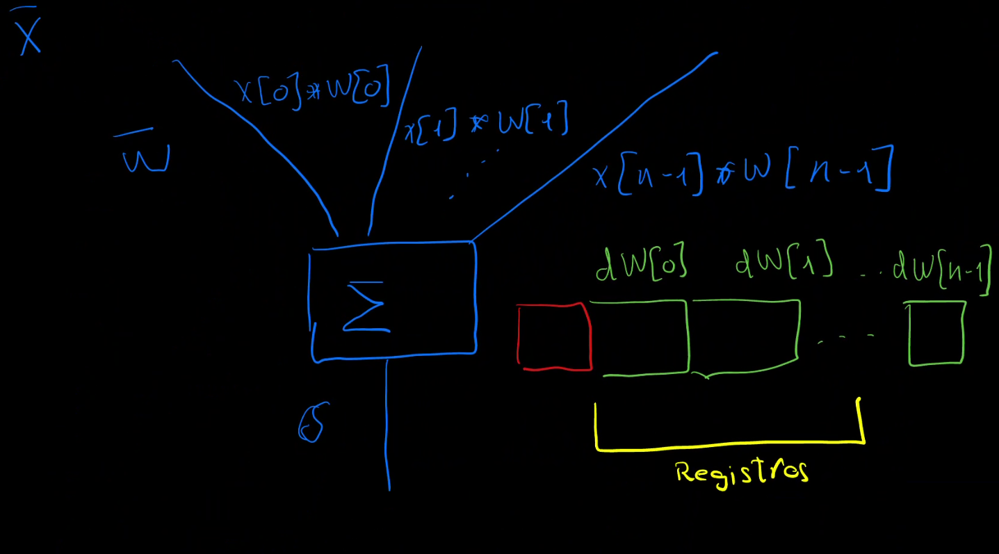
Este gráfico representa una neurona. La operación principal que realiza una neurona es un producto escalar entre una entrada **x** y un vector de pesos **x**. Dicha salida sufre habitualmente una trasformación, mediante una función de activación, la sigmoide por ejemplo. 

Es importante recordar que:
- Cada neurona tiene un vector de pesos propios **w**.
- Dicho vector de pesos es el que queremos aprender a ajustar con un método iterativo. 
- Para ello necesitamos al final el error y como es el gradiente de los pesos con respecto a dicho error.
- La regla de la cadena son multiplicaciones y el orden no afecta al resultado, por lo tanto podemos computar el gradiente desde el inicio al final como desde el final al inicio.

Si aplicamos el modo forward:
- Se realizará el cálculo desde el inicio al final.
- Deberemos almacenar:
  -  El resultado del cálculo, celda roja.
  -  Tantos gradientes como pesos tengamos previamentes.

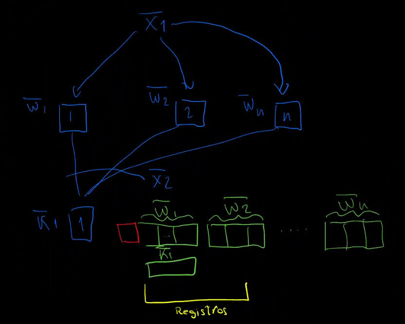
Las capas de una red neuronal se apilan. Cuando se llega a la segunda capa los gradientes previos toman un tamaño exponencial.
La propuesta es quedarse con un conjunto de los gradientes fijo, llamemoslé registros a este número, en rememoración de los registros de un procesador. El resto, los menos sifnificativos, los menores en valor absoluto, serán purgados, ignorados.

- Hay una función de activación, que de momento podemos ignorar el objetivo es ver la estructura de memoria que necesitamos, no que contiene.
  - EL OBJETIVO NO ES SABER LAS DERIVADAS DE LOS PESOS. 
  - Para la explicación no me interesa cómo es la derivada/gradiente, sino cuantos gradientes he de guardar.
  - La función de activación no cambia el número de gradientes/registros. Toda función unaria solo cambia el contenido no el número de registros.

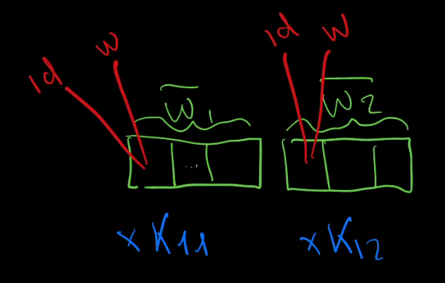
- Cada gradiente contiene un valor y un identificador que indica la posición del peso.
Calcular los registros de gradiente suponen 
- Los pesos previos en una red neuronal se multiplican por el nuevo peso. 
- Cada neurona se debe seleccionar los pesos mas significativos.
## ¿Cómo se utilizan lo gradientes?
* Un corpus de entrenamiento se compone de un conjunto de parejas (**x**,**y**).
* Para una pareja de entrenamiento la red neuronal transforma la **x** en **y'**, siendo esta última la salida predicha..
* Al final tenemos **y'** e **y**. Pero la comparación no se reliza directamente.
* Si agrupamos varios resultados (batch) podemos calcular una función de pérdida (L)

$$
L = \frac{1}{N} \sum_{i=1}^{N} \left( y'_i - y_i \right)^2
$$

Esta seria la función de pérdida si usaramos el error cudrático medio.

* Minimizar la función de pérdida significa minimizar el error. 
* El error tiene un conjunto de gradientes que marcan una dirección que permite minimizar.
* Sabemos la relación de los pesos **w** con respecto a L.
* Podemos cambiar ligeramente el valor de los pesos y podremos minimizar iterativamente el error.
* Un gradiente es alto en términos absoluto significa afecta mucho al error.
* La corrección se realiza proporcional al error.
### Hipótesis 
* ¿PODEMOS IGNORAR LOS GRADIENTES PEQUEÑOS?
* ¿PODEMOS IGNORAR LA CORRECCIÓN DE LOS PESOS QUE AFECTAN MENOS?
### Propuesta
* Realizar un pruning dinámico y solo quedarse con los gradientes más significativos (mayor valor absoluto).
* El cálculo de los gradientes se pueden hacer en paralelo.

# Entender las limitaciones de tensorflow/NVIDIA.
## ¿Cuánto es paralelizable? ¿Cuántas multiplicaciones se pueden realizar a la vez? 
Dado que el modo forward "supone" realizar no solo un cálculo, sino el cálculo de los registros de gradientes. Y dado que cada registro supone realizar una multiplicación podemos hacer un estudio centrado en las multiplicaciones que nos permita entender:
- Las limitaciones lógicas que hacen que no todo el hardware de una GPU se usen.
- Entender que esa capacidad ociosa es compatible con el cálculo del dinamic pruning in forward mode.

Al realizar la inferencia hay un número de multiplicaciones que se realizan simultáneamente, en concreto es el producto dado por:
- neuronas de la capa a computar. 
- tamaño de **x**, ya que cada neurona multiplica un peso por cada entrada.
- Entrenamientos (tamaño del batch), ya que se pueden realizar en paralelo todos los entrenamientos para hacer la actualizacion del gradiente.
  - Nótese que no es conveniente utilizar lotes grandes ya que el proceso de convergencia y de ajuste neuronal se ralentece.


Por ejemplo en nmist, entrenando con una 4070 móvil, he observado se usa solo un 30% GPU.

Otra cuestión es el tiempo real. 
- ¿Qué latencia tiene llamar a un kernel 20 ms al menos?
- No es eficiente para procesos en tiempo real. Existe TensorRT de NVidia. 
- He programado inferencias de redes neuronales en CPU pasando de 70 ms en tensorflow a 1 ms en python/numpy.
- Por ejemplo, si se realiza una ejecución con 16 registros, tardaría al menos 17 ms. Es una comparación cpu-gpu. Obviamente al incluir un entrenamiento de un lote razonable 10, ya serian 170 ms.

# Autodiferenciación.
* La autodiferenciación simplifica los cálculos.
* Es como usar un número complejo, salvo que hay "resolución" partes imaginarias. 


Aquí tienes un conjunto de instrucciones detalladas para registrarse en GitHub, generar una clave SSH, subirla a GitHub, configurar Git y finalmente clonar un repositorio usando una clave SSH.

## autofore.py
Es una librería en python.

Para entender las derivadas remito a:
https://colah.github.io/posts/2015-08-Backprop/ 


* Autofore es muy cómodo.
* Autocontenida, import random,math,time
* 247 líneas.
* Se desarrolló realizando verificaciones cruzadas y usando la libería de diferenciación simbólica de python.
    * simbolica->python->numpy->numba
* Tengo una versión con la segunda derivada Hessiana para convergencia de Newton.
* No la he incluido estas versiones porque no aportan.
* Se usará para:
  - Desarrollar sistemas más rápidos (pruebas unitarias).
  - Aprender/Divulgar.


Incluye un ejemplo_red_neuronal_polinomios:
```python
    # SISTEMA DE ECUACIONES y dimensiones

    # A   * B   = C
    # z*x * x*y = z*y
    x=2
    y=4
    z=4
    
    def f0(*args):
        return sum(args)
    def f1(a,b):
        return 1*a+2*b
    def f3(a,b):
        return 10*a+2*b
    def f4(a,b):
        return 2*a+5*b
```

Se verifica que el sistema converge:
```
1.0 1.0
1.0 2.0
10.0 2.0
2.0 5.0
Tiempo de ejecución:  0.4389042854309082
```

```python
  error=cp-c
  error2=error*error
  errorTotal+=error2.value
  
  for b1 in B:
      b=b1[yy]
      b.delta+=error2.get(b)

  epsilon=0.01
  for b1 in B:
      b=b1[yy]
      b.value-=b.delta*epsilon
```
Así se computa la función del error.

Nota: No se ha utilizado un lote. Lo ideal es acumular varios ejemplos y luego aplicarlo.

# Pruning

```python
class Variable:
    def __init__(self, nn):
        self.nn=nn
        self.value = 0

    def pruning(self):
        if self.nn.pruning==0:
            return 
        topDelta=[0]*self.nn.pruning
        for delta in self.forward:
            adelta=abs(delta)
            for m,td in enumerate(topDelta):
                if td<adelta:
                    aux=topDelta[m]
                    topDelta[m]=adelta
                    adelta=aux
        for i,delta in enumerate(self.forward):
            adelta=abs(delta)
            if adelta<topDelta[-1]:
                self.forward[i]=0

```
Autofore incluye la capacidad de eliminar los pesos más significativos.

## Ejecución de simpleTensorFlow.py

```python
    model=Sequential()
    model.add(Dense(5, input_dim=ancho, activation='sigmoid'))
    for c in range(1):
        model.add(Dense(5, activation='sigmoid'))
    model.add(Dense(1))
    model.compile(optimizer=SGD(), loss='mean_squared_error')
````
### Explicación didáctica de la red neuronal en el código:

Este código crea una **red neuronal simple** usando la biblioteca **Keras** de **TensorFlow**. La red tiene varias capas densas (o completamente conectadas), y está diseñada para aprender a partir de datos de entrada y generar una salida. El propósito general podría ser resolver un problema de regresión.

### 1. **Definir el modelo**:

```python
model = Sequential()
```

- **`Sequential()`**: Este comando crea un modelo **secuencial**. Es la forma más simple de construir una red neuronal en Keras, donde las capas se añaden una tras otra de forma secuencial. Cada capa tiene una conexión directa con la capa siguiente.
  
---

### 2. **Añadir la primera capa densa (fully connected)**:

```python
model.add(Dense(5, input_dim=ancho, activation='sigmoid'))
```

- **`Dense(5)`**: Esto añade una **capa densa** con **5 neuronas**. Una capa densa significa que cada neurona de esta capa está conectada con todas las neuronas de la capa anterior (o con la entrada).
  
- **`input_dim=ancho`**: Esto especifica que el **tamaño de entrada** tiene `ancho` características o valores (puede ser el número de variables que estás usando como entrada). Por ejemplo, si estás prediciendo un valor basado en 3 características (como temperatura, presión y humedad), `ancho` sería 3.

- **`activation='sigmoid'`**: La función de activación **sigmoid** convierte el resultado de cada neurona en un valor entre 0 y 1. Las funciones de activación permiten que la red capture no linealidades en los datos y aprendan patrones más complejos.

---

### 3. **Añadir otra capa densa**:

```python
for c in range(1):
    model.add(Dense(5, activation='sigmoid'))
```

- **Capa adicional**: Este bucle `for` se ejecuta una vez, añadiendo otra **capa densa con 5 neuronas** y activación `sigmoid`. Esta capa toma como entrada los valores de la capa anterior y procesa esos datos.

- **Capas ocultas**: Estas capas adicionales (llamadas **capas ocultas**) permiten que la red neuronal aprenda relaciones más complejas. Las redes con más capas se conocen como redes profundas (de ahí el término "aprendizaje profundo").

---

### 4. **Añadir la capa de salida**:

```python
model.add(Dense(1))
```

- **`Dense(1)`**: Esto añade una **capa de salida** con **1 sola neurona**, lo que indica que el modelo está diseñado para predecir un **único valor**. Por ejemplo, si el objetivo es predecir el precio de una casa o la temperatura del día siguiente, esta única neurona proporcionará ese valor.
  
- **Sin función de activación**: La capa de salida no tiene una función de activación. Esto es típico en problemas de regresión donde el valor predicho no está limitado a un rango específico (como en clasificación, donde podría estar limitado entre 0 y 1).

---

### 5. **Compilar el modelo**:

```python
model.compile(optimizer=SGD(), loss='mean_squared_error')
```

- **`optimizer=SGD()`**: El optimizador es el algoritmo que ajusta los pesos de las neuronas para minimizar el error de la red. En este caso, se utiliza el **Gradiente Descendente Estocástico** (**SGD**), un algoritmo básico y efectivo para actualizar los pesos.

- **`loss='mean_squared_error'`**: La función de pérdida es lo que mide qué tan mal está prediciendo el modelo durante el entrenamiento. Aquí se usa el **error cuadrático medio** (**Mean Squared Error, MSE**), que es típico en problemas de regresión. Mide la diferencia entre los valores reales y los predichos, elevándolos al cuadrado (para penalizar grandes errores).


Este código crea una **red neuronal simple** con:
1. Una capa de entrada que acepta `ancho` características.
2. Una capa oculta con 5 neuronas y activación `sigmoid`.
3. Una segunda capa oculta con 5 neuronas (agregada dentro de un bucle, pero solo una capa en este caso).
4. Una capa de salida con una neurona, que predice un único valor.

El modelo se entrena utilizando **Gradiente Descendente Estocástico** para minimizar el **error cuadrático medio**. En términos simples, esto significa que la red intentará ajustar sus pesos para reducir la diferencia entre las predicciones y los valores reales a lo largo de varios ciclos de entrenamiento (llamados "épocas").

# Pruebas


En este gráfico se observa la pérdida producida por el error cuadrático medio (loss) tanto con el entrenamiento como con el corpus de validación (val_los).

* Suele coincidir mínimo trainning con real.
  * Esto quiere decir que podemos con el entrenamiento saber cual es la configuracion que conduce a mejor resultado real.
  * Red neuronal de 61 parámetros.
  * Se testean 2,4,8,16,32,64, tamaño completo.

El procedimiento DPFM comparado con tensorflow.
* Dinamic Pruning (DPFM) loss: 0.1763 - val_loss: 0.1557
* TensorFlowloss: 0.2588 - val_loss: 0.2454
  * Tensorflow no consigo replicarlo, es ligeramente menor.
  * La inferencia es perfecta. La diferencia debe estar en alguna parte del entrenamiento.
*  pero al final DPFM con pruning es mejor.

Comparación transversar azul 16 registro. naranja sin limitacion. 250 épocas.
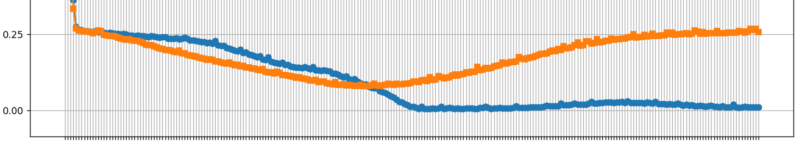
Forma de interpretar la gráfica:
- Si se alcanza el mínimo en training loss => tenemos el mínimo en validación.
- Si nos plantamos en el mínimo significa que nos quedamos con el mínimo alcanzado.

# Potencial de una FPGA
En este apartado se establece una cota inferior de al menos cuanto tiempo tardaría una FPGA en realizar en paralelo las multiplicaciones. Obviamente comparamos tensorflow, un sistema real con una capacidad de paralelización teórica. El objetivo es ver el orden de magnitud. 

El código en python actual tarda 567s vs 6,5 s de TensorFlow, es decir 10 veces más.

¿Se puede acelerar?

Multiplicaciones de la prueba realizada en una capa:
    - 10 batch x  5 neuronas x 5 pesos x 17 registros = 4250 multiplicaciones.
   - Una gpu Zynq Z2 puede realizar 220 multiplicaciones en paralelo. Tiene una frecuencia de reloj de 100 Mhz.
   - 4250 multiplicaciones son 20 ciclos => 200 ns.
   - 2 capas, 5 ejecuciones => 2 x 5 x 200 ns = 0.002 ms frente a los 6500 ms de Tensorflow. Estamos hablando de 6 ordenes de magnitud.

En inferencia se ha realizado ya aceleraciones de x70. De 70ms a 1ms en pequeñas redes neuronales, al pasar de tensorflow a numpy (CPU).

NVidia es consciente de esta latencia, ya que tiene productos como TensorRT (real time).

Nota: Modelos grandes como GPT-3 (con 175 mil millones de parámetros) pueden tardar semanas o meses en entrenarse, incluso utilizando cientos o miles de GPUs o TPUs en paralelo.


# Potencial de publicaciones.
* Alternativa a NVIDIA.
* Revisión de todas la arquitecturas de RRNN.
  * No creo que sea una respuesta de blanco o negro, creo que será un depende.
  * Quizá aprendizaje en tiempo real, empotrado.
  * Aprendizaje distribuido.
* Construcción de librerías.
* Construcción de hardware. 

# Pruebas II
¿Cómo se interpreta? 
* si min loss => min val_los lo importante es el mínimo alcanzado.

Iremos ampliando el tamaño del corpus de entrenamiento y viendo los efectos de usar mas o menos registros.
En la leyenda se representan los registros. El 0 es especial, significa que se utilizan todos los registros que sean preciso. El resto a menor número de registros empleados significa mayor pruning. Nótese que 0 y 64 son equivalentes ya que el problema planteado tiene solo 61 registros. 

Con un corpus de 50:
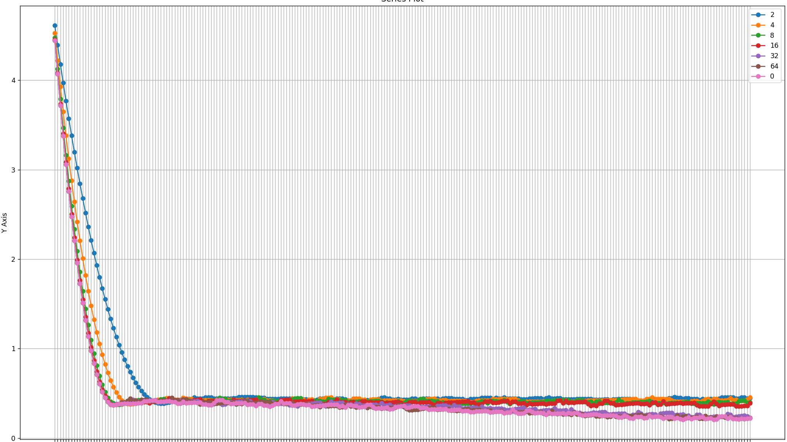

Con un corpus pequeño no se observan mejoras, tanto la de 0 como 64 conducen a mejores resultados y una convergencia inicial mas rápida.

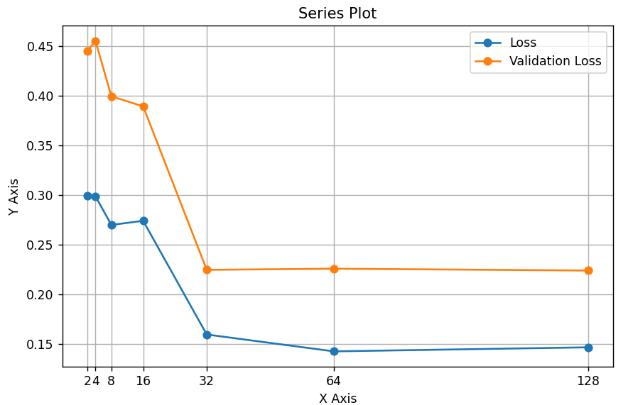

Como el corpus es pequeño la validación es peor que el entranamiento, como cabría esperar. Este diagrama representa un corte trasversal al final del entrenamiento.

Con corpus intermedio 100:
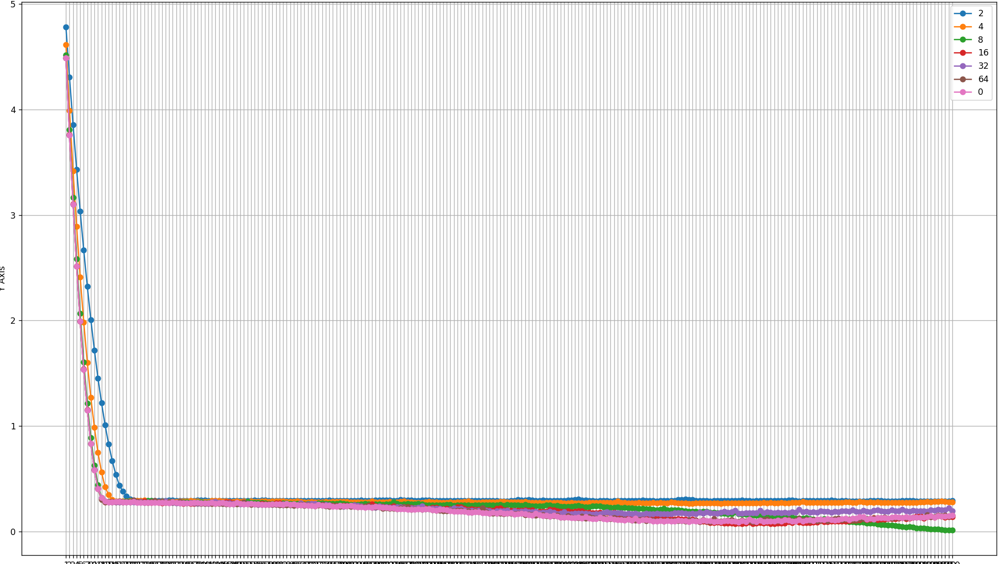

Con un corpus de cierto tamaño, se observa que con 8 registros se consigue un mínimo cercano a 0.

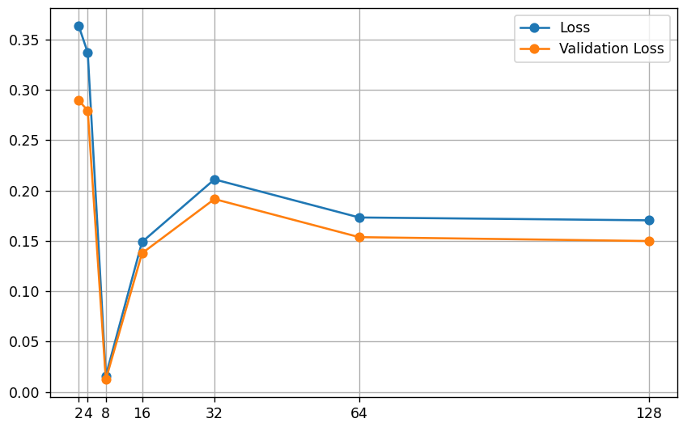

Dicho mínimo se puede observar tanto en entranamiento como en validación. La idea es que el mínimo de entrenamiento sea el seleccionado.

Con un corpus de 200:
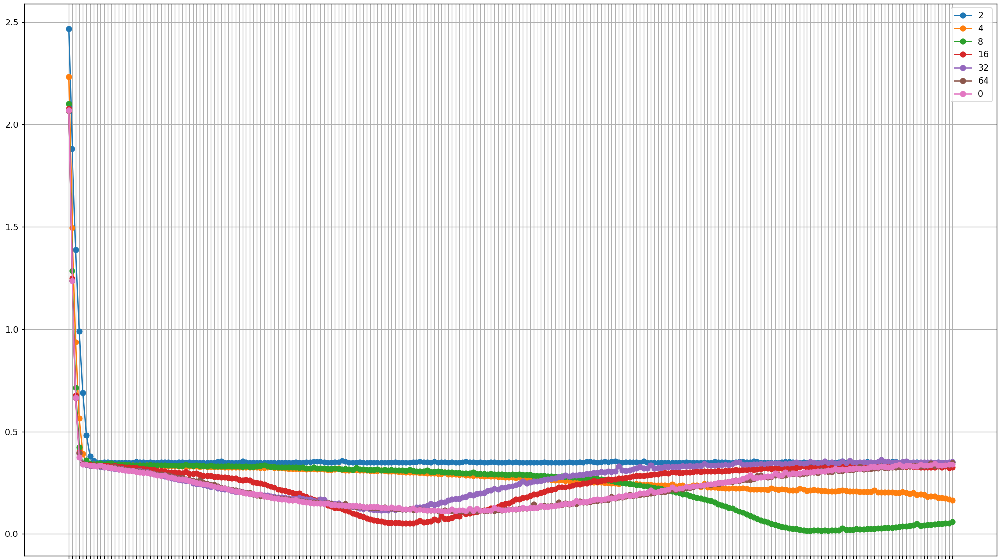 

8 y 4 registros destacan. Aunque la convergencia es mas lenta, es cierto que debe ser más rápida la ejecución con un número menor de registros. Luego podriamos imaginar que realmente con menos registros se llega antes a la convergancia.

con corpus de 400:
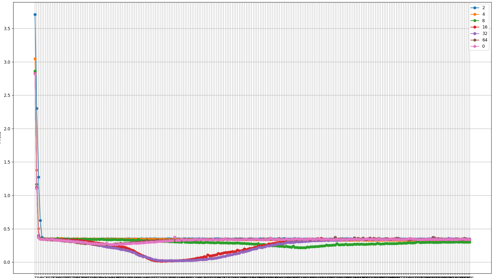

La versión de 16 y 32 registros son las mejores. Aunque luego tienen un rebote típico del sobre-entrenamiento. 

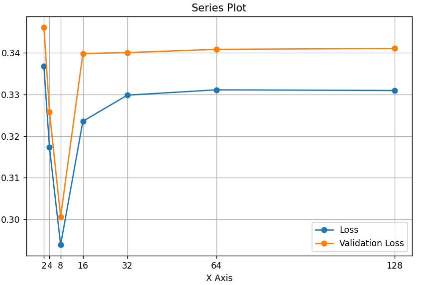

# Energía
La backpropagation realiza dos pasadas para el cálculo del gradiente. Una primera pasada es equivalente a la inferencia. Y una segunda en sentido inversa calculando los gradientes.
A priori la comparación con el modo forward parece que es menos eficiente por que por cada registro debemos calcular todo el gradiente desde el peso al dato final. Realmente se suele decir que depende del número de pesos y el número de salidas. Cuando hay muchos pesos y pocas salidas la backpropagation produce menos cálculos. En cambio cuando hay pocos pesos y muchas salidas el modo forward ha resultado ser mejor.

Sin embargo cuando se introduce el pruning solo se transmiten una porción mínima de registros, los más significativos, produciendo una mejora. 

Hay que tener en cuenta que el cálculo de los gradientes es paralelizable. Y que al suprimir muchos de los gradientes es en cierta forma más eficiente de ahorrar cálculos, que el algoritmo de backpropagation debería hacer. Además solo se requiere una lectura de los pesos ya que solo requiere una pasada. El de backpropagatión requiere dos lecturas de pesos. Y estamos hablando de una información que no se puede beneficiar en el aprendizaje profundo de una caché ya que las redes neuronales profundas se caracterizan por un voluminoso tamaño de los pesos.

# Limitaciones.
Se han de realizar pruebas con un modelo mas complejo. Está previsto en el itinerario.

Seguramente la aproximación pueda ser beneficiosa para ciertos tipos de redes neuronales. Sospecho que las convolucionales y las recurrentes son muy apropiadas.

Las capas fully conected no son muy eficientes. A continuación detallo un posible análisis preliminar de un cirtuito de Toper que ilustrará las posibles limitaciones.

## Proceso de Toper
Una parte del proceso implica seleccionar por cada capa los mejores gradientes. El circuito toper: top+sorter es un diseño preliminar de dicha operacion.

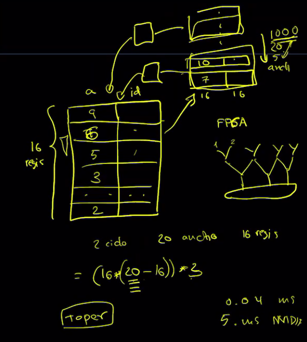
Si tenemos un espacio de 16 registros deseamos introducir en dichos registros los gradientes más significativos. 
Dada que cada registro se compone de dos partes, una para almacenar el gradiente (a) y otra para almacenar el identificador del peso (id). Cuando llega un nuevo gradiente, resultado de una multiplicación, hemos de recorrer los registros, haciendo comparación uno a uno, en el momento que uno de los contenido en los registros sea menos significativo (menor en términos absolutos) será intercambiado por el nuevo. Se puede continuar con el cambiado hasta el final. Dicho algoritmo es similar al de la burbuja.

Nótese que simultáneamente se puede comenzar ubicando un nuevo candidato. Pasado 16 ciclos habría una comparación-intercambio si menor por cada registro.

Suponiendo que son tres operaciones, comparación, e intercambio (el intercambio son dos operaciones por el uso de una registro auxiliar) el número total de ciclose vendría dado por la fórmula:

(registros*(candidatos-registros))*ciclos.

Siendo:
- registros: el número de registros a topetizar.
- candidatos: el número de resultados de gradientes a seleccionar.
- ciclos: los tres ciclos comentados.

En el ejemplo hemos supuesto 16 registros, 20 candidatos y 3 ciclos. 

Como puede observarse el cuello de botella se da cuando el número de candidatos es muy grande. Esto suele ocurrir en las capas neuronales del tipo fully conected. Algunas veces con anchuras del orden de 1000 conexiones. 

Esta operación se puede paralelizar, es decir podemos tener una estructura jerárquica de circuitos topers trabajando con distintas zonas y luego sus resultados volviendo a introducirlos en un nuevo toper.

Esto es una propuesta inicial, el diseño de un circuito con capacidad de seleccionar los registros mas significativos es crítico.

Hay que tener presente que dicha operación se repite por cada neurona. Aunque es paralelizable.

# Conclusiones
* Potencial de aceleración depende más del proceso de toper que de las multiplicaciones.
* Hay algunos tipos de redes neuronales, que por su toplogía son mas apropiados.
* El pruning no solo es una cuestión de aceleración, sino que mejora la validación.

# Itinerario
Se abre ante nosotros el eterno dilema de construir o verificar. El presente trabajo hasta ahora es una verificaciónd de un ejemplo sencillo. Como la verificación ha sido exitosa, se desea escalar el sistema con capacidad de verificación se modelos mas complejos.

Es posible una implementación en GPU, por ejemplo usando Numba.

- Acelerar la librería de python.
- Realizar pruebas con NMIST.
- Publicar artículos.
- Tesis doctoral.
- Realizar prototipos con FPGAs.

# Ensayo
El proceso de convergencia, de agrupación por lotes no debería de ser el único. Puede haber otros procesos de aprendizaje. Nada nos indica que debemos realizar un sistema de aprendizaje con etapas tan cuadriculadas, igualnúmero de muestras, síncronas, aprendizaje solo al final de objetivo. Sin aprendizajes parciales.
Tengo la hipótesis que cualquier proceso que transmita gradientes y sea el fruto de un proceso de selección natural conducirá a la adaptación, al aprendizaje a la inteligencia. En este sentido es interesante investigar como se puede dar otros modelos de propagación e incluso ver si las etapas de ajuste de peso se pueden modelar mediante el mismo mecanismo de aprendizaje.

Un caso especial es el aprendizaje por eventos. En el, la necesidad de ejecución se modela por pulsos. ¿Por qué no modelar de la misma manera la capacidad de aprender? Es lógico pensar que cuando una parte del sistema no llega a los niveles deseados, el proceso de aprendizaje se puede despertar y afinar.

En la literatura es común que parejas de redes neuronales trabajen en conjunto, por ejemplo, en el actor crítico dos redes neuronales trabajan en conjunto, una intentando adivinar cuando un ejemplo es natural y artificial y la otra intentando inventar ejemplos que la primera no pueda detectar. En el aprendizaje por refuerzo se produce una navegación por el espacio de hipótesis, y una red neuronal indica la probabilidad de tomar un camino, mientras la otra identifica la recompensa que proporciona los distintos estados. Separar el modelo en dos redes neuronales y que trabajen en conjunto realizando un juego ha demostrado ser productivo. De hecho es el factor que tienen en común los últimos avances, incluso los propios modelos de lenguaje profundo tienen sistema de pregunta respuesta, y exploración del conjunto de resultados, moderados por la temperatura. ¿Por qué no es posible que dos sistemas de aprendizaje, mediante un protocolo se complemente?

En este sentido el aprendizaje en modo forward tiene un potencial y una elasticidad que no tiene la backpropagation. Ya que puede mantener la memoria de los gradientes hasta que se decida por un evento realizar el ajuste. Es fácil mantener en memoria un conjunto de ajustes a realizar en unos determinados pesos. Sin embargo no ocurre lo mismo con la backpropagation ya que tiene que mantener el grafo de operaciones.

En este sentido sería viable desarrollar sistemas de aprendizaje independientes, distribuidos? Y luego en un protocolo unir dichas convergencias? No es eso lo que realiza de forma síncrona el aprendizaje tradicional?

Por lo tanto un aprendizaje distribuido va mas allá del aprendizaje por eventos. Ya que no es solo la etapa de inferencia la que cubre sino también la de aprendizaje.

Esta dicotomía entre etapa de aprendizaje, etapa de inferencia me parece una aberración que nos ha impuesto las limitaciones técnicas del actual modelo. Yo abogo por el aprendizaje online, en concebir sistemas que no separen ambos modos, en sistemas con una capacidad de plasticidad y adaptación ante nuevos eventos.

Ya que últimamente la ciencia no es ciencia si no se acompaña de una aplicacion práctica hay un par de temas en los que he realizado incursiones, al aplicar la autodiferenciación, como son:

- Aplicación a robótica.
- Aplicación a protocolos de conducción autónoma. 
  - Y en concreto al diseño de protocolos emergentes para evitar colisiones y mejorar el desempeño.
- Aplicación a la distribución eléctrica.