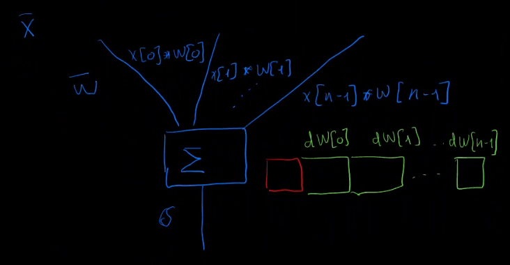
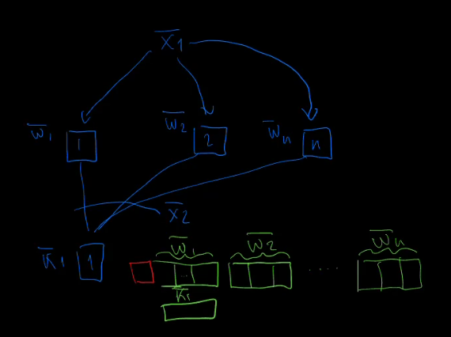
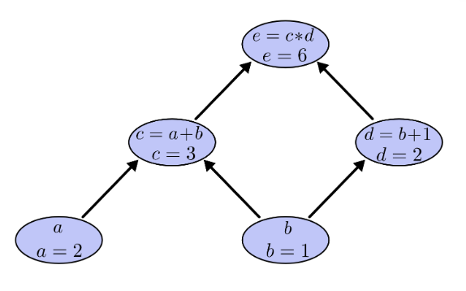
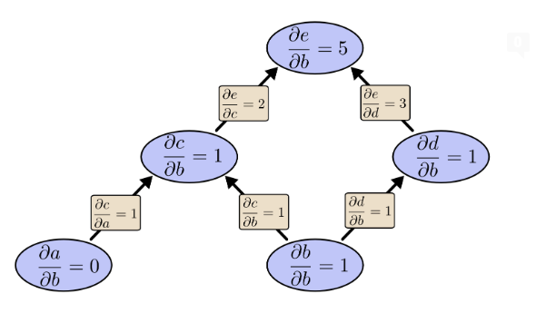
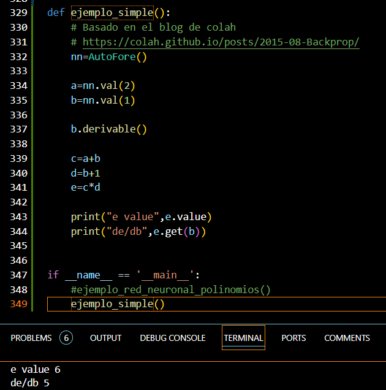
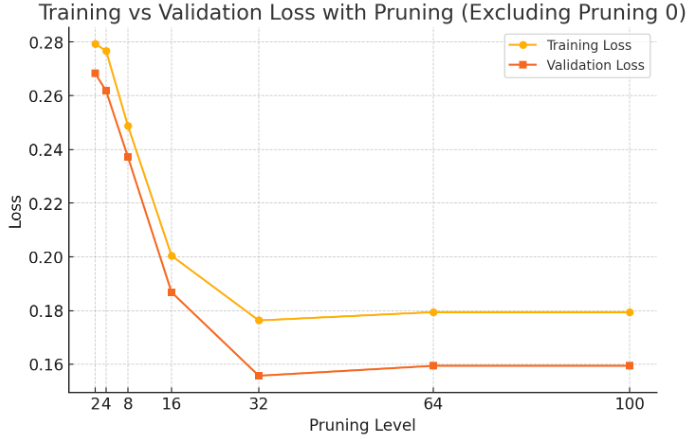

# Taller de Redes Neuronales.

Automatic Differentiation: Dinamic Pruning in Forward Mode

Fecha: Jueves 24 de 10:30 a 12:30 
Lugar: Seminario de ATC 
Impartido por: David Ragel Díaz-Jara

# Hipótesis
- Es posible desarrollar redes neuronales mas eficientes mediante el paralelismo que proporciona Dinamic Pruning in Forward Mode.
- Es posible crear un hardware específico para entrenar. Nota: ahora esta de moda hardware especifico de inferencia.
- El modo forward permite una dinámica en las conexiones que no permite la backpropagation.

# Metodología práctica.
- Traeté tu portátil, a ser posible con nvidia.
- Todo el código en github.
- Propondré retos concretos a los que quieran colaborar.
- Alcance: Hasta donde permitan estas dos horas.
- Si gusta, repetiré periódicamente la experiencia.
- Crearé videos, para el que no pueda asistir o el que quiera repasar pueda repetir el taller.

# Temario 
- Es más fácil entender una red neuronal usando autodiferenciación y modo forward.
  - Sobrecarga de operadores en python.
  - Topología básica de una red neuronal.
    - Producto escalar.
    - Activación sigmoide.
  - Batchs, gradientes y minimizacion del error cuadrático medio.

- Prunning.
  - Latencia de tensorflow.
  - Entender el potencial paralelizable y la infrautilizacion de recursos.
  - En funciones sencillas el prunning es beneficioso.

- Desarrollo sin errores.
  - Simbolico.
  - Python -> numpy.
  - numpy -> numba.

- Harware (busco colaboradores)  
  - Potencial de una FPGA.
  - Tensor RT y latencia.
  - Soñemos con una alternativa mas eficiente que NVIDIA.
  - Potencial de artículos. Revisión de todas las arquitecturas de redes neuronales.
  - Construcción de una librería.


# Explicación de una Red Neuronal en modo Forward.
- Es más fácil entender una red neuronal usando autodiferenciación y modo forward.
- No incluyo cálculo de derivadas, porque no es importante.
  - Quedaros con que la derivada de una multiplicación es una multiplicación.
- A continuación explicamos algo equivalente al algoritmo de backpropagation que requiere dos pasadas.
- El modo forward requiere una pasada. Pero la estructura de datos es mas compleja.

Es el eterno dilema entre memoria y tiempo de programación dinámica.

"Si quieres algo mas rápido gasta memoria".

¿Qué memoria debemos incorporar?


- Cada neurona tiene un vector de pesos **w**.
- Realiza un producto escalar entre la entrada **x** y los pesos **w**
- Hay una función de activación, que de momento podemos ignorar el objetivo es ver la estructura de memoria que necesitamos, no que contiene.
- EL OBJETIVO ES SABER LAS DERIVADAS DE LOS PESOS PRECEDENTES

- Para la explicación no me interesa cómo es la derivada/gradiente, sino cuantos cálculos he de guardar.
## ¿Cómo se utilizan lo gradientes?
* En un entrenamiento al final tenemos **y'** e **y**. 
* Si agrupamos varios resultados (batch) podemos calcular una función de pérdida (L)

$$
L = \frac{1}{N} \sum_{i=1}^{N} \left( y'_i - y_i \right)^2
$$

* Minimizar la función de pérdida significa minimizar el error. 
* Sabemos la relación de los pesos **w** con respecto a L.
* Podemos cambiar ligeramente el valor de los pesos y podremos minimizar iterativamente el error.
* Un signo positivo en la misma dirección.
* Un gradiente alto afecta mucho.
* Se realiza proporcional al error.
## Hipótesis 
* ¿PODEMOS IGNORAR LOS GRADIENTES PEQUEÑOS?
* ¿PODEMOS IGNORAR LA CORRECCIÓN DE LOS PESOS QUE AFECTAN MENOS?
## Propuesta
* Realizar un prunning dinámico y solo quedarse con los gradientes más significativos (mayor valor absoluto).
* Si el número de gradientes es fijo equivale al tamaño de una palabra del procesador.
  * Mayor tamaño, mayor precisión.
* Las operaciones de derivadas se pueden hacer en paralelo.

# Entender las limitaciones de tensorflow/NVIDIA.
## ¿Cuánto es paralelizable? ¿Cuántas multiplicaciones se pueden realizar a la vez? 
- neuronas, tamaño de **x**, entrenamientos (batch), (¿capas? no por caché)
  - Por ejemplo en nmist se usa solo un 30% GPU.
- ¿Qué latencia tiene llamar a un kernel 20 ms al menos?
- No es eficiente para procesos en tiempo real. Existe TensorRT de NVidia.
- Estamos proponiendo por cada multiplicación realizar 1+resolución?
## Sobrecarga de operadores en python.
* La autodiferenciación simplifica los cálculos.
* Es como usar un número complejo, salvo que hay "resolución" partes imaginarias. 


Aquí tienes un conjunto de instrucciones detalladas para registrarse en GitHub, generar una clave SSH, subirla a GitHub, configurar Git y finalmente clonar un repositorio usando una clave SSH.

### 1. Registro en GitHub
1. Ve a [GitHub](https://github.com).
2. Haz clic en **Sign up**.
3. Ingresa tu dirección de correo electrónico, crea una contraseña y elige un nombre de usuario.
4. Sigue los pasos para verificar tu correo y completar el proceso de registro.

### 2. Generar una clave SSH
1. Abre una terminal (en Linux o macOS) o Git Bash (en Windows).
2. Escribe el siguiente comando para generar una clave SSH:
   ```bash
   ssh-keygen -t rsa -b 4096 -C "tu_correo@ejemplo.com"
   ```
   - Sustituye `"tu_correo@ejemplo.com"` por el correo que usaste en GitHub.
3. Te pedirá la ubicación para guardar la clave, presiona **Enter** para aceptar la ubicación predeterminada.
4. Si deseas, puedes agregar una contraseña para proteger la clave, o simplemente presiona **Enter** para omitir este paso.

   Esto generará dos archivos: una clave privada y una clave pública. La clave pública tendrá la extensión `.pub`.

### 3. Añadir la clave SSH a GitHub
1. Abre la clave pública generada. Puedes hacerlo con el siguiente comando:
   ```bash
   cat ~/.ssh/id_rsa.pub
   ```
2. Copia el contenido que se muestra en la terminal.
3. Ve a GitHub y sigue estos pasos:
   - Haz clic en tu foto de perfil (esquina superior derecha) y selecciona **Settings**.
   - En el menú de la izquierda, selecciona **SSH and GPG keys**.
   - Haz clic en el botón **New SSH key**.
   - Dale un título a la clave (puede ser el nombre de tu computadora o cualquier identificador).
   - Pega la clave pública que copiaste en el campo correspondiente.
   - Haz clic en **Add SSH key**.

### 4. Configurar Git
1. Abre la terminal o Git Bash y configura tu nombre de usuario y correo electrónico para Git:
   ```bash
   git config --global user.name "Tu Nombre"
   git config --global user.email "tu_correo@ejemplo.com"
   ```
2. Ahora configura Git para usar la clave SSH recién creada. Si Git no puede encontrar tu clave por defecto, puedes añadirla al agente SSH:
   ```bash
   eval "$(ssh-agent -s)"
   ssh-add ~/.ssh/id_rsa
   ```

### 5. Clonar el repositorio usando SSH
1. En la terminal, navega al directorio donde deseas clonar el repositorio:
   ```bash
   cd /ruta/del/directorio
   ```
2. Clona el repositorio usando la URL SSH:
   ```bash
   git clone git@github.com:daradija/dinamic-pruning-in-forward-mode.git
   ```


¡Sí, hay una forma más simple! Visual Studio Code es lo suficientemente inteligente como para detectar el tipo de proyecto en el que estás trabajando y sugerirte automáticamente las extensiones necesarias. Aquí te explico cómo hacerlo de manera más sencilla:

### 1. Instalar Visual Studio Code
1. Ve a [Visual Studio Code](https://code.visualstudio.com/).
2. Descarga e instala la versión adecuada para tu sistema operativo (Windows, macOS o Linux) siguiendo las instrucciones en pantalla.

### 2. Instalar Python (si no lo tienes)
1. Descarga Python desde [python.org](https://www.python.org/downloads/).
2. Instala Python asegurándote de marcar la opción **Add Python to PATH** durante la instalación (en Windows).

### 3. Abrir un proyecto o archivo Python en Visual Studio Code
1. Abre **Visual Studio Code**.
2. Ve al menú **File** y selecciona **Open Folder** o **Open File**.
   - Selecciona la carpeta de tu proyecto Python o un archivo `.py`.

### 4. Visual Studio Code detectará automáticamente Python
1. Al abrir el archivo o proyecto, Visual Studio Code detectará automáticamente que estás trabajando con Python y te sugerirá instalar las extensiones necesarias.
   - Una ventana emergente aparecerá en la esquina inferior derecha preguntando si deseas instalar la extensión **Python**.
2. Haz clic en **Install** para que Visual Studio Code instale la extensión oficial de Python.

# autofore.py
Para entender las derivadas remito a:
https://colah.github.io/posts/2015-08-Backprop/ 






* Autofore es muy cómodo.
* Se desarrolló haciendo cálculo simbólico.
  * Tengo una versión con la segunda derivada
  * No la he incluido porque no aporta.
* Se usa para:
  - Desarrollar sistemas más rápidos (pruebas unitarias).
  - Aprender.

En el ejemplo_red_neuronal_polinomios:
```python
    # SISTEMA DE ECUACIONES y dimensiones

    # A   * B   = C
    # z*x * x*y = z*y
    x=2
    y=4
    z=4
    
    def f0(*args):
        return sum(args)
    def f1(a,b):
        return 1*a+2*b
    def f3(a,b):
        return 10*a+2*b
    def f4(a,b):
        return 2*a+5*b
```

Se verifica que el sistema converge:
```
1.0 1.0
1.0 2.0
10.0 2.0
2.0 5.0
Tiempo de ejecución:  0.4389042854309082
```

```python
  error=cp-c
  error2=error*error
  errorTotal+=error2.value
  
  for b1 in B:
      b=b1[yy]
      b.delta+=error2.get(b)

  epsilon=0.01
  for b1 in B:
      b=b1[yy]
      b.value-=b.delta*epsilon
```
Así se computa la función del error.

Nota: No se ha utilizado un lote. Lo ideal es acumular varios ejemplos y luego aplicarlo.

# Prunning
Ejecución de simpleTensorFlow.py

```python
    model=Sequential()
    model.add(Dense(5, input_dim=ancho, activation='sigmoid'))
    for c in range(1):
        model.add(Dense(5, activation='sigmoid'))
    model.add(Dense(1))
    model.compile(optimizer=SGD(), loss='mean_squared_error')
````



* Tarda x10 567s vs 6,5 s de TensorFlow. (código python)
* Suele coincidir mínimo trainning con real.
  * Red neuronal de 61 parámetros.
  * Se testean 2,4,8,16,32,64, tamaño completo.
* DinamicPrunningloss: 0.1763 - val_loss: 0.1557
* TensorFlowloss: 0.2588 - val_loss: 0.2454

